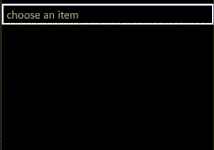

# Titanium.UI.Picker

<TypeHeader/>

## Overview

| Android | iOS | Windows |
| ------- | --- | ------- |
|  |  |  |

Use the <Titanium.UI.createPicker> method or Alloy **`<Picker>`** element to create a picker control.

On Android, the `useSpinner` property must be enabled to support multiple columns.
By default, the spinner is automatically sized to fit its content and can overflow
to additional spinner rows. The size of the picker can be adjusted with the `width`
and `height` properties, but may omit picker columns or cut off picker rows
if the size is set too small. This property is deprecated. Please use the default
Android native "dropdown" style by not setting `useSpinner` to `true`.

On iOS, the `height` property is only available in iOS 9 and later.
By default, the size of the picker, including its background, is fixed at the
same height as the iPhone keyboard to respect the
[iOS Human Interface Guidelines](https://developer.apple.com/ios/human-interface-guidelines/overview/themes/#//apple_ref/doc/uid/TP40006556-CH15-SW3).
The default `width` on iOS is 320px and the `height` is 228px.
The contents of the picker are sized to fit the picker, which may cut off text
in the picker rows. Adding views to picker rows is also supported on iOS.

On iPad, Apple recommends using a picker only in a popover.  Since the size of the picker
cannot be adjusted, it is not suitable for the main screen.

**Note:** you can only set the [columns](Titanium.UI.Picker.columns) property for the plain picker.
If you set the [type](Titanium.UI.Picker.type) property to anything else except
`Titanium.UI.PICKER_TYPE_PLAIN`, you cannot modify the picker's columns.

## Examples

### Multi-Column Picker using Alloy XML Markup

Creates a picker with two columns.  You can optionally use `Column` and `Row` as shorthand
notation for `PickerColumn` and `PickerRow`, respectively.

`app/views/index.xml`:
``` xml
<Alloy>
    <Window id="win" backgroundColor="white" layout="vertical" exitOnClose="true">
        <Picker id="picker" top="50" selectionIndicator="true" useSpinner="true">
            <PickerColumn id="column1">
                <PickerRow title="Bananas"/>
                <PickerRow title="Strawberries"/>
                <PickerRow title="Mangos"/>
                <PickerRow title="Grapes"/>
            </PickerColumn>
            <!-- Picker shorthand notation -->
            <Column id="column2">
                <Row title="red"/>
                <Row title="green"/>
                <Row title="blue"/>
                <Row title="orange"/>
            </Column>
        </Picker>
    </Window>
</Alloy>
```

`app/controllers/index.js`:
``` js
$.win.open();
```

### Date Picker using Alloy XML Markup

Creates a date picker, then monitors the `change` event to see when the user updates the picker.

For the date string, use string values accepted by the moment.js constructor in the XML and TSS files.
If you are defining dates in the controller code, use a JavaScript Date object.

`app/views/index.xml`:
``` xml
<Alloy>
    <Window backgroundColor="blue">
        <Picker id="picker"
          onChange="report"
          type="Ti.UI.PICKER_TYPE_DATE"
          minDate="2014,4,1"
          maxDate="May 1, 2014 12:00:00"
          value="2014-04-15T12:00:00">
        </Picker>
    </Window>
</Alloy>
```

`app/controllers/index.js`:
``` js
function report(e) {
    Ti.API.info('User selected: ' + e.value);
}

$.index.open();
```

### Basic Single Column Picker

Create a one-column, platform-specific style, picker and automatically select a row.

``` js
Ti.UI.backgroundColor = 'white';
var win = Ti.UI.createWindow({
  exitOnClose: true,
  layout: 'vertical'
});

var picker = Ti.UI.createPicker({
  top:50
});

var data = [];
data[0]=Ti.UI.createPickerRow({title:'Bananas'});
data[1]=Ti.UI.createPickerRow({title:'Strawberries'});
data[2]=Ti.UI.createPickerRow({title:'Mangos'});
data[3]=Ti.UI.createPickerRow({title:'Grapes'});

picker.add(data);
picker.selectionIndicator = true;

win.add(picker);
win.open();

// must be after picker has been displayed
picker.setSelectedRow(0, 2, false); // select Mangos
```

### Multi-Column Picker

Create a two-column, platform-specific style, picker and automatically select a row in
each column.

``` js
Ti.UI.backgroundColor = 'white';
var win = Ti.UI.createWindow({
  exitOnClose: true,
  layout: 'vertical'
});

var picker = Ti.UI.createPicker({
  top:50,
  useSpinner: true
});
picker.selectionIndicator = true;

var fruit = [ 'Bananas', 'Strawberries', 'Mangos', 'Grapes' ];
var color = [ 'red', 'green', 'blue', 'orange' ];

var column1 = Ti.UI.createPickerColumn();

for(var i=0, ilen=fruit.length; i<ilen; i++){
  var row = Ti.UI.createPickerRow({
    title: fruit[i]
  });
  column1.addRow(row);
}

var column2 = Ti.UI.createPickerColumn();

for(var i=0, ilen=color.length; i<ilen; i++){
  var row = Ti.UI.createPickerRow({ title: color[i] });
  column2.addRow(row);
}

picker.add([column1,column2]);

win.add(picker);

win.open();

// must be after picker has been displayed
picker.setSelectedRow(0, 2, false); // select Mangos
picker.setSelectedRow(1, 3, false); // select Orange
```

### Date Picker

Create a date picker and handle the subsequent user action.

``` js
Ti.UI.backgroundColor = 'white';
var win = Ti.UI.createWindow({
  exitOnClose: true,
  layout: 'vertical'
});

var picker = Ti.UI.createPicker({
  type:Ti.UI.PICKER_TYPE_DATE,
  minDate:new Date(2009,0,1),
  maxDate:new Date(2014,11,31),
  value:new Date(2014,3,12),
  top:50
});

win.add(picker);
win.open();

picker.addEventListener('change',function(e){
  Ti.API.info("User selected date: " + e.value.toLocaleString());
});
```

### Date Picker using showDatePickerDialog() (Android only)

Create a date picker that is automatically displayed as a modal dialog and handle the
subsequent user action.

``` js
Ti.UI.backgroundColor = 'white';

var picker = Ti.UI.createPicker({
  type:Ti.UI.PICKER_TYPE_DATE,
  minDate:new Date(2009,0,1),
  maxDate:new Date(2014,11,31),
  value:new Date(2014,3,12)
});

picker.showDatePickerDialog({
  value: new Date(2010,8,1),
  callback: function(e) {
    if (e.cancel) {
      Ti.API.info('User canceled dialog');
    } else {
      Ti.API.info('User selected date: ' + e.value);
    }
  }
});
```

<ApiDocs/>
